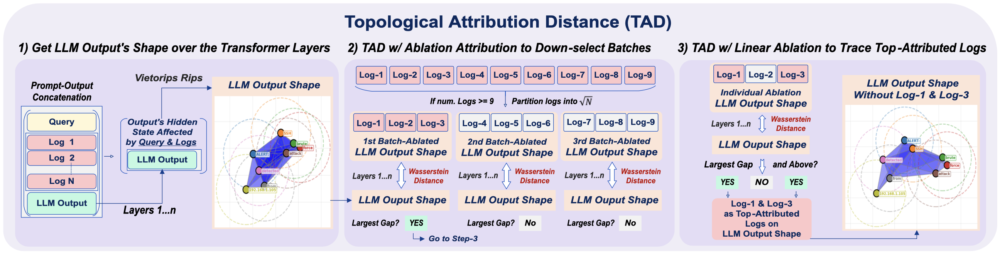

# Topological Attribution Distance (TAD)

 **Topological Attribution Distance (TAD)**, inspired by Topology, is an explainable metric to characterize and capture the global geometric shape of an LLM output and its changes against its retrieved logs. TAD is powered by segment-level ablation attribution to
investigate incident logs of an actual cyberattack. This can provide an explainable and trustworthy tracing based on each LLM's hidden state to understand how geometrically different retrieved logs influence the model generation, and provide evidence verification in cybersecurity and Agentic-AI workflows.




## How it works

**1. Shape of the output.** The full prompt: query, `<<logN>>` blocks, task reminder, and the response itself is passed through a decoder-only LLM in a single forward pass with `output_hidden_states=True`. The response-token hidden states are sliced out of every layer (the embedding layer is dropped: it reflects token identity, not context). Each layer's response point cloud is turned into a Vietoris–Rips filtration and a persistence diagram (`tad/topology.py:persistence_from_hidden_state`), giving a per-layer description of the output's global geometry.

**2. Ablation attribution.** A log (or a group of logs) is ablated from the prompt, the forward pass is repeated, and the ablated diagrams are compared with the baseline layer-by-layer using the 1-Wasserstein distance between persistence diagrams. Summing over layers gives the log's **total Wasserstein change on removal** and TAD's attribution score. Large change means the log was load-bearing for the shape of the response.

**3. Adaptive search.** Ablating every log individually costs one forward pass per log. TAD instead runs a *screen-then-confirm* search (`tad/attribution.py`):

- **Screen** — partition the logs into `ceil(sqrt(N))` groups, ablate each group once, and flag the "hot" groups. Cold groups are pruned. 
- **Confirm** — ablate the logs in the final hot pool individually and flag spikes again to localize which specific logs carry the attribution.

Note that If number of logs are below `MIN_GROUPING_LOGS` logs (or with `--linear`), the screen is skipped and every log is ablated individually.

**4. Spike detection.** Attribution scores are sorted descending and cut at their largest adjacent gap (`tad/spikes.py:flag_spikes`). This adapts to the scale of each sample and imposes no prior on how many spikes to expect.

## Installation

Requires Python >=3.10,<3.14. Using [uv](https://docs.astral.sh/uv/):

```bash
uv sync
```

Note: Models are fetched from the Hugging Face Hub. Put a token in `.env` at the repo root:

```
HF_TOKEN=hf_...
```

## Usage

```bash
python -m tad data/claude_regular_log_analysis.json -m Qwen/Qwen3-4B --homology h0
```

`tad.py` at the repo root is a shortcut for the same entry point.

| Flag | Default | Meaning |
| --- | --- | --- |
| `input` | — | Path to the log-analysis dataset JSON |
| `-o, --output` | `tad_spike_<model>_<homology>.json` | Results path |
| `-m, --model` | `meta-llama/Llama-3.2-3B-Instruct` | Any decoder-only causal LM with a fast tokenizer |
| `-t, --max-tokens` | all | Limit the analysis to the first N response tokens |
| `-k, --last-k-layers` | all | Compute topology only over the last K hidden-state layers |
| `--homology` | `h0` | `h0`, `h1`, or `both` (H0+H1) |
| `--groups` | `ceil(sqrt(N))` | Group count for the first screen round |
| `--linear` | off | Ablate every log individually; skips the screen |


## Dataset

`data/attack_dataset.json` is a real multi-host Windows intrusion: 10 windows, 587 logs, 20 of them attacker actions (the ground truth), the rest genuine benign activity. The `data/DatasetOverview.md` gives the full details of the dataset. 


| File | Variant | Response |
| --- | --- | --- |
| `claude_direct_log_analysis.json` | `direct` | Quotes log fields verbatim — maximal overlap |
| `claude_regular_log_analysis.json` | `regular` | Natural analyst prose — incidental overlap |
| `claude_indirect_log_analysis.json` | `indirect` | Anonymized paraphrase — zero content-token overlap |

That is the test: Recovering the same ground-truth logs in all thre cases means the signal was the geometry of the hidden state, not the string overlap.


## Package layout

| Module | Role |
| --- | --- |
| `config.py` | Constants, `AttributionConfig`, `ResponseSpanError` |
| `topology.py` | Vietoris–Rips persistence, total persistence, per-layer Wasserstein change |
| `prompts.py` | Prompt reconstruction, `<<logN>>` parsing/removal, log partitioning |
| `spikes.py` | Largest-gap spike detection |
| `model.py` | Model loading, response-span location, per-layer persistence diagrams |
| `attribution.py` | `SpikeAttributor`: the screen-then-confirm engine |
| `runner.py` | Dataset orchestration, HF auth, result I/O |
| `reporting.py` | Human-readable progress logging |
| `cli.py` / `__main__.py` | Argument parsing and entry point |


## License

Licensed under the Apache License, Version 2.0 (the "License");
you may not use this file except in compliance with the License.
You may obtain a copy of the License at

     http://www.apache.org/licenses/LICENSE-2.0

Unless required by applicable law or agreed to in writing, software
distributed under the License is distributed on an "AS IS" BASIS,
WITHOUT WARRANTIES OR CONDITIONS OF ANY KIND, either express or implied.
See the License for the specific language governing permissions and
limitations under the License.
